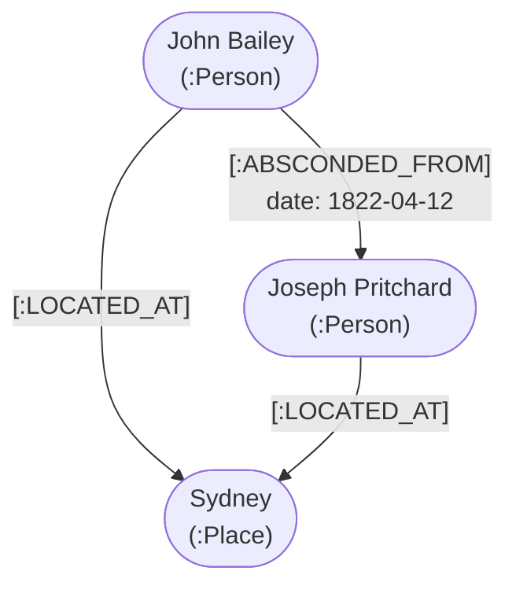

---


If you spend enough time in the digital humanities, you will eventually hit a methodological ceiling.

As discussed in our previous notes on [[The Digital Toolkit/Data Pipelines\|Data Pipelines]] and [[Methodology & Theory/The Shape of History\|EAV models]], Australian colonial history has benefited massively from the transcription of 19th-century ledgers into spreadsheets. Spreadsheets are fantastic for quantitative analysis. You can calculate average crop yields, track convict populations over time, or count how many people arrived in a given year. However, they suffer from severe structural rigidity.

By forcing the complex and networked nature of the past into two-dimensional rows and columns, we systematically strip historical data of its most important element. That element is context.

> [!danger] The Spreadsheet Problem 
> A spreadsheet can easily record that a convict was employed by a specific settler. However, capturing multiple overlapping relationships (kinship, employment, shared transport) in a spreadsheet becomes unwieldy. Even a relational database can capture these relationships, but querying them requires complex joins.

To capture the true complexity of human history, we need a data model where relationships are treated as primary, first-class evidence. We need to move from the table to the web. We need a Graph Database.

## What is a Graph Database?

When most people hear the word "graph," they picture a bar chart or a line graph plotting statistics. In computer science, however, a graph database has nothing to do with charts.

It is built on Graph Theory, which is simply the mathematical study of networks. Imagine a physical map of a railway system. The stations are the data points, and the train tracks connecting them are the relationships. That is a graph. It maps the world as many historians think about it: as a web of interconnected people, places, and events.

> [!info] The Two Dominant Graph Data Models
While graph databases vary in implementation, most systems used in practice, especially in the digital humanities, fall into two dominant data models:
>
>**1. RDF (Resource Description Framework) Triplestores:**
These are highly standardized databases designed for sharing linked data across the web. They represent information as Subject–Predicate–Object triples, a structure conceptually similar to [[Methodology & Theory/The Shape of History\|Entity–Attribute–Value]] modeling. RDF excels at interoperability, semantic clarity, and long-term data reuse.
>
>**2. Labeled Property Graphs (LPG):**
Used by platforms such as Neo4j, this model allows both nodes and relationships to carry arbitrary properties. This flexibility makes LPG particularly well suited to complex historical modeling, where relationships themselves often require rich contextual description.
While other graph architectures and hybrid systems exist, these two models account for the vast majority of graph databases in active scholarly use.

If we focus on the Labeled Property Graph (LPG) model, the database is built from four simple components:

1. **Nodes (The Entities):** The nouns of your database. A node can be a `Person`, a `Place`, or a `Source Document`.
2. **Edges (The Relationships):** The verbs that connect the nouns. Edges define exactly how two nodes are connected (e.g., `MARRIED_TO`, `EMPLOYED_BY`, `ABSCONDED_FROM`). Crucially, edges have a strict direction.
3. **Properties:** The adjectives. Both Nodes and Edges can hold specific key/value facts. This is the structural superpower of the LPG model. You can attach a property like `Date: 1822` directly to an `ABSCONDED_FROM` edge, giving the relationship its own historical context.
4. **Labels:** Tags applied to Nodes to quickly categorize them, making searches lightning fast (e.g., tagging all human nodes as `:Person`).

## The Mechanics of Connection: SQL vs. Graph

To understand why graph databases are transformative for historical research, we have to look at how traditional Relational Databases (SQL) actually work. Relational databases do not store relationships directly. Instead, they store data in isolated tables and force the computer to calculate the relationships on the fly using something called a "Join."

Let us look at a classic colonial event: John Bailey absconded from his master, Joseph Pritchard.

### The Relational (SQL) Approach

To record this event in SQL without creating a messy, unsearchable spreadsheet, you must build three separate tables and connect them using abstract ID numbers (Foreign Keys).

**Table 1: Convicts**

|Convict_ID|Name|Arrival_Year|
|---|---|---|
|C-101|John Bailey|1818|

**Table 2: Masters**

|Master_ID|Name|Location|
|---|---|---|
|M-505|Joseph Pritchard|Sydney|

**Table 3: Absconding_Events (The Join Table)**

|Event_ID|Convict_ID|Master_ID|Date|
|---|---|---|---|
|E-999|C-101|M-505|1822-04-12|

If you want to ask the database, "Who did John Bailey abscond from?", the computer must perform a computational task. It has to scan the Convicts table to find John's ID (C-101), scan the Events table to find a match, extract the Master's ID (M-505), and finally scan the Masters table to retrieve the name Joseph Pritchard. In practice, with proper indexing, these lookups are extremely fast. However, the principle remains: the database must perform multiple lookups rather than following a pre-stored connection.

>[!abstract] In computer science, this is called the Join Penalty.
> For a single query on a small dataset, this takes milliseconds and is not a problem. Modern SQL databases with proper indexing handle this efficiently. However, as your dataset grows and your questions become more complex, the computational cost increases.


>[!warning]
>If you want to ask a complex historical question like, *"Find all convicts who absconded from masters who lived in Sydney and previously employed someone from the same transport ship,"* the database must perform multiple joins across several tables. 

The more complex your query, the more joins required, and the slower the response although modern SQL optimizers can mitigate this in many real-world queries.

### The Graph Approach

A graph database eliminates this problem entirely because it physically stores the relationship as a permanent connection on the hard drive. There are no tables and no abstract ID numbers to cross-reference.

When you load this event into a graph, the database literally draws a wire between the two historical figures:




When you ask the graph, "Who did John Bailey abscond from?", the database does not have to scan thousands of rows in a master table. It simply goes to John Bailey's node and follows the [:ABSCONDED_FROM] arrow directly to Joseph Pritchard.

> [!info] The Pointer Hop 
> In a graph database, following a single relationship is extremely fast. It takes the same computational power to jump from John Bailey to Joseph Pritchard whether your database contains ten people or ten million. However, most historical queries require multiple hops through the network. Finding all convicts connected to a magistrate through various relationship types requires traversing multiple edges. The real advantage of graph databases is that these multi-hop queries scale better than SQL joins because the relationships are pre-computed and physically stored, not calculated on the fly.

By removing the computational friction of complex SQL joins, we can finally map massive, continent-spanning networks of colonial administration and query them in real-time.

## The EAV Connection (Building the Graph)

If you read the previous post on the EAV format, you might be wondering how these two concepts connect.

EAV is the perfect extraction format because it breaks messy archival data down into Semantic Triples: a Subject, a Predicate, and an Object. For example, _John Doe_ -> _Received Lashes_ -> _50_.

The transformation from EAV to a Labeled Property Graph requires a simple sorting process. Your pipeline looks at the EAV triples and divides them into two categories. If the triple describes a relationship between two distinct entities (like _John_ -> _Employed By_ -> _Joseph_), it draws an Edge connecting those two nodes. If the triple describes a static fact (like _John_ -> _Lashes Received_ -> _50_), it simply stores that fact as a Property directly inside John's node. This keeps the graph clean and computationally fast.

You can think of EAV as the flat, reliable format we use to safely extract facts from the physical archive. The Graph Database is where we take thousands of those isolated EAV triples and stitch them together into a massive, interconnected historical reality.

## Pros and Cons of Graph Databases

Before migrating your entire research project, it is vital to understand that graph databases are specialized tools. They are not a universal replacement for spreadsheets or relational databases.

**The Pros:**

- **Context Preservation:** Relationships are stored physically in the database. When you analyze the data or apply network analysis algorithms, they see the exact historical context surrounding an individual. A convict is not just a row in a table. They are a node connected to their masters, their family members, their fellow transport arrivals, and the places they lived.
- **Schema Flexibility:** If you discover a new type of relationship in an archive, you just draw a new edge. You never have to redesign your entire database structure. Found evidence of a godparent relationship? Add a [:GODPARENT_OF] edge. No schema migration required.
- **Pathfinding:** They excel at discovering hidden connections. You can easily ask the database to find the shortest path of relationships between a convict in Hobart and a magistrate in Sydney, or identify all people connected through kinship networks to a specific family.

**The Cons:**

- **Terrible at Global Aggregations:** If you want to calculate the "average age of all 10,000 convicts in the colony," a spreadsheet will do it in a millisecond. A graph database will struggle because it has to traverse the entire network node by node to find the answer. For statistical analysis, you still need a relational database or spreadsheet.
- **The Learning Curve:** You have to learn a new query language (like Cypher) because standard SQL does not work. This is not insurmountable, but it is an investment.
- **Setup Complexity:** Unlike SQL, LPG databases like Neo4j are technically "schema-optional." You do not strictly have to define node types before ingestion to make the database accept the data, though it is a best practice for clean data pipelines. Therefore, translating flat CSV files into a functional graph network requires robust Python scripting. While the database itself is flexible, mapping exactly which EAV triples should become Nodes, Edges, or Properties requires careful architectural planning before you run your ingestion scripts.
- **Data Quality Amplification:** Graph databases amplify data quality problems. A single incorrect relationship can create false network paths that mislead analysis. This makes the data pipeline discussed in the previous post even more critical. Your EAV extraction must be rigorous before ingestion into a graph.

## When NOT to Use Graph Databases

Graph databases are specialized tools. They excel at relationship discovery but struggle with global aggregations. Before committing to a graph database, ask yourself these questions.

**Is your dataset small?** If you have fewer than 10,000 records and your research focuses on specific individuals rather than network analysis, a relational database is simpler and faster. The added complexity of a graph database is not worth the overhead.

**Do you need aggregate statistics?** If your primary research questions are "What was the average age of convicts?" or "How many people arrived in 1820?", a spreadsheet or SQL database will serve you better. Graph databases are not designed for this type of analysis.

**Is your schema stable?** If you know exactly what relationships you are tracking and that will not change, SQL's rigid structure is actually an advantage. You can optimize your queries and indexes for known patterns.

>[!abstract] Graph databases shine when your research questions fundamentally require understanding how entities connect across the entire dataset. 

They are worth the complexity only when relationship discovery is central to your work. If you are asking questions like "Who was connected to whom through kinship, employment, and transport networks?" or "What is the shortest path of relationships between these two individuals?", then a graph database is the right tool.

## Querying the archive

The real power of a graph database becomes apparent when you want to ask complex historical questions. Graph query languages are designed to trace paths through networks visually.

With Cypher, if we want to find every instance of a convict running away from a master in our database, we can write a simple query:

 ```cypher
 MATCH (p1:Person)-[:ABSCONDED_FROM]->(p2:Person)
 RETURN p1.name, p2.name
 ```

>This elegant query will instantly return a two-column list of every absconder and their master across the entire dataset.
 
But the real power emerges with multi-hop queries. If we want to find **all convicts who absconded from masters who employed someone from the same transport ship**, we can ask:

```cypher
MATCH (c:Person)-[:ABSCONDED_FROM]->(m:Person)-[:EMPLOYED]->(other:Person)
MATCH (c)-[:ARRIVED_ON]->(ship:Vessel)<-[:ARRIVED_ON]-(other)
WHERE c <> other
RETURN c.name AS Absconder, m.name AS Master, other.name AS CoWorker, ship.name AS Ship
```

### Translating the Code

If you have never written a line of code in your life, you can still read this query by breaking it down line by line:

* **`MATCH (c:Person)-[:ABSCONDED_FROM]->(m:Person)-[:EMPLOYED]->(other:Person)`**
  This is the first path we are tracing. We are telling the database to find any Person (who we will temporarily call 'c' for convict) who ran away from another Person (who we will call 'm' for master). We then ask it to trace the line forward to see if that master employed *another* Person (who we will call 'other').

* **`MATCH (c)-[:ARRIVED_ON]->(ship:Vessel)<-[:ARRIVED_ON]-(other)`**
  Now we take those exact same people ('c' and 'other') and check if they share a second connection. Do they both point to the exact same ship?

* **`WHERE c <> other`**
  This is our reality check. Because the master technically employed the convict who ran away, the database might try to count the absconder as the "other" person too. This line forces the computer to ensure that 'c' and 'other' are two completely distinct human beings.

* **`RETURN c.name AS Absconder, m.name AS Master, ...`**
  Finally, we tell the database what to hand back to us. Instead of returning raw, messy data nodes, we ask for a clean, four-column list with nice, readable headers. 

By stacking these simple matches together, we can uncover complex, hidden networks of association that a standard spreadsheet would completely obscure.


> In SQL, this query would require joining five or six tables and would be difficult to read and maintain. In Cypher, the pattern is visually intuitive. You are literally drawing the network pattern you are looking for.


## Conclusion: Context is King

For colonial history specifically, graph databases enable research questions that spreadsheets and even relational databases struggle with. You can find networks of kinship and patronage, trace the movement of individuals across the colony, and discover hidden connections between seemingly unrelated records. As your dataset grows and your research questions become more network-focused, these capabilities become increasingly valuable.

However, graph databases are not a magic solution. They are a specialized tool for a specific type of research question. If you are primarily interested in statistical analysis or aggregate trends, stick with spreadsheets and SQL. If you are interested in network analysis, relationship discovery, and understanding the complex web of colonial society, a graph database is worth exploring.

If you are interested in exploring graph databases for your own historical project, start small. Build a prototype with 100 to 200 records and a single relationship type. Learn Cypher. Experiment with pathfinding queries. Then decide if the added complexity is worth the analytical power for your specific research questions.

---

### Cite this post

If you found this methodology useful for your own work, you can cite it here:

> McLean, Mark. "From Tables to Webs: Why Digital History Needs Graph Databases." _The Digital Stockade_. Published 2026-03-29. https://thedigitalstockade.github.io/methodology-and-theory/from-tables-to-webs